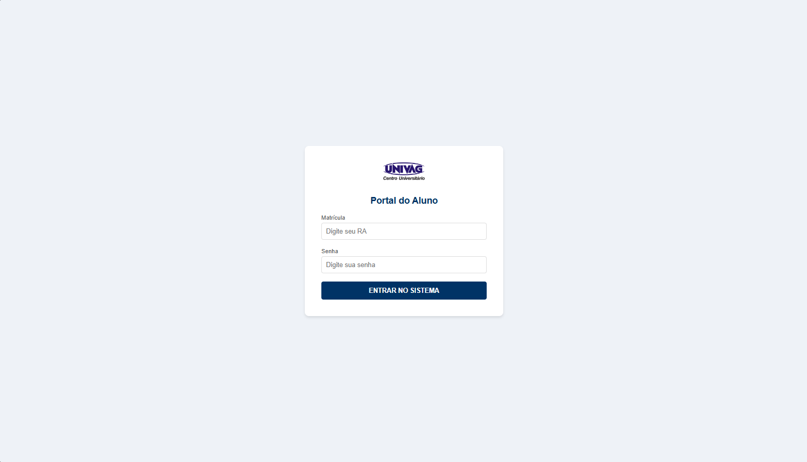
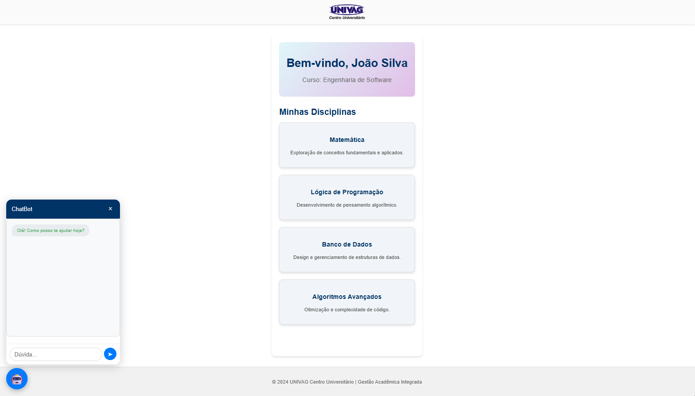
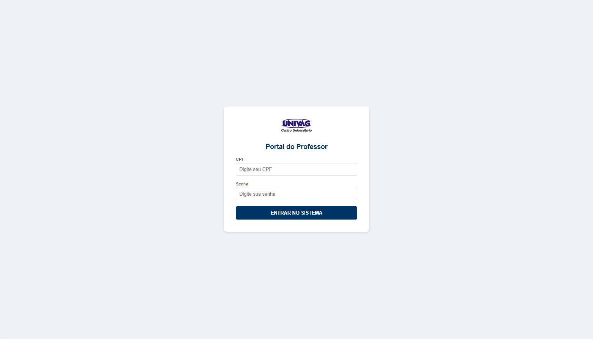
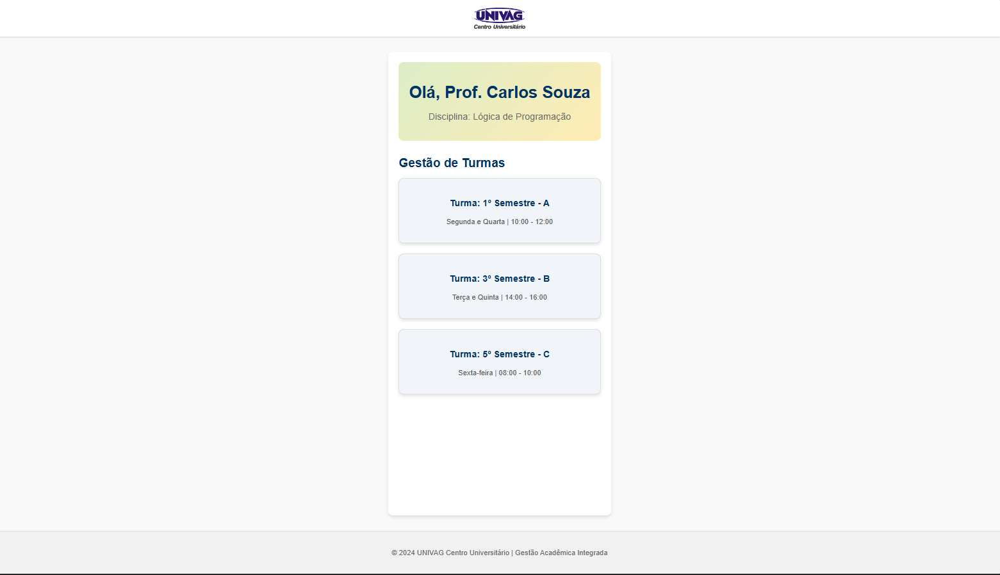
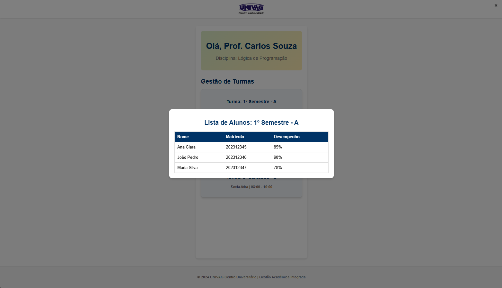

# WALL-E | Adaptive Learning Platform 🤖


**WALL-E** is an adaptive learning platform designed to bridge the gap between students and teachers. It features a specialized dashboard for both roles and an **AI-simulated chatbot** to provide real-time support for students.

---

## 🚀 Features

- **AI-Powered Chatbot:** Interactive widget in the student dashboard for instant queries (Simulated with Flask backend).
- **Dual Role Access:** Dedicated interfaces for students and teachers.
- **Student Management:** Teachers can view class lists and student performance metrics via interactive modals.
- **Responsive Design:** Optimized layout for different screen sizes.
- **Professional Backend:** Structured with Flask (Python) using clean routing and API principles.

---

## 📸 Screenshots

### Project Entrance


### Student Experience
<p align="center">
  
  
</p>

### Teacher Experience
<p align="center">
  
  
</p>

### Advanced Data View


---

## 🛠️ Installation & Setup

To run this project locally, follow these steps:

1. **Clone the repository:**
   ```bash
   git clone [https://github.com/Paulorgdc/WALL-E.git](https://github.com/Paulorgdc/WALL-E.git)
   cd WALL-E
